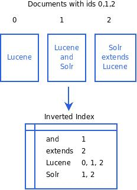

<!SLIDE smbullets incremental transition=blindx>
# Lucene #
* Originally a sourceforge project
* Joined Apache Jakarta in Sep 2001
* Became a top level project in Feb 2005
* Written by Douglas Cutting
* Tagline: Lucene is a free (as in free beer) / open source IR library
* Released under the Apache License

<!SLIDE smbullets incremental transition=growx>
# Ports #
* PyLucene
* Ruby
* Lucene.Net
* Delphi
* Perl
* C++
* PHP

<!SLIDE center full-page transition=growy
# Lucene Index format #
* reverse / inverted index

